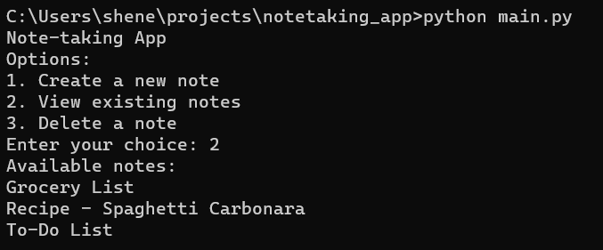

# Note-taking App

This is a simple text-based note-taking application built using Python. It allows users to create, view, and delete notes. Each note is stored as a separate text file in the "notes" directory.

## Features

- Create new notes with titles and multiple lines of content.
- View a list of existing notes.
- Delete notes by providing the note title.
- Basic command-line interface.

## Project Structure

- `notes/`: Directory to store note files.
- `main.py`: Main Python script for the application.

## Usage

1. Run `main.py`.
2. Choose options:
   - Create a new note.
   - View existing notes.
   - Delete a note.
3. Follow the prompts to perform actions.

## Dependencies

This project doesn't have any external dependencies. It's a pure Python application.

## License

This project is open-source and available under the [MIT License](LICENSE).